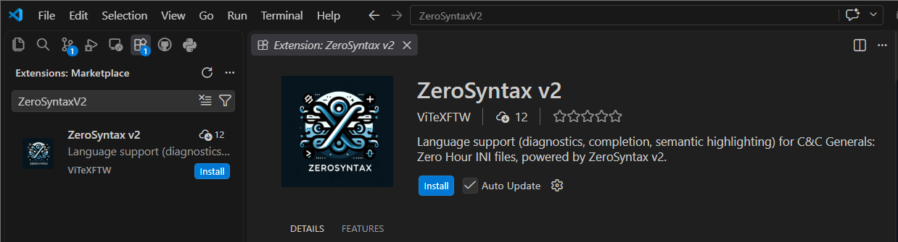
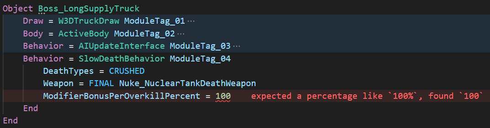
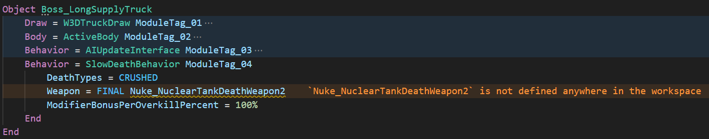
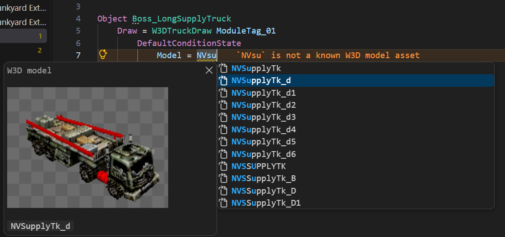
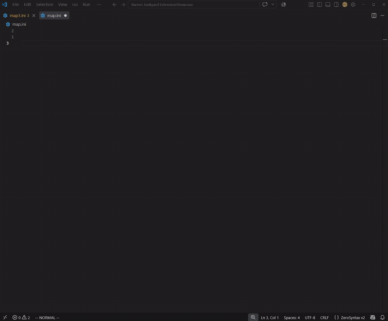

<p align="center">
  
</p>

<p align="center">
  <a href="https://github.com/ViTeXFTW/ZeroSyntaxV2/actions/workflows/ci.yml">
    
  </a>
  <a href="https://github.com/ViTeXFTW/ZeroSyntaxV2/releases/latest">
    
  </a>
  <a href="LICENSE">
    
  </a>
</p>

## 📝 About the projet
This project was born from the frustration when creating maps with `map.ini` changes. The SAGE engine is very selective and will crash if files contain unknown fields or values, being a software developer I wished language features such as diagnostics and completions was a part of the development flow. Thus `ZeroSyntax` was born.


## ⚡ Quick start
The easiest way to get started is to use the VSCode extension inside VSCode. This will install the server and automatically recognize INI files

1. Open VSCode
2. Go to the `Extensions` tab
3. Search `ZeroSyntaxV2`
4. Install the extension

<p align="center">
  
</p>

Opening a map folder or ini file will now be parsed and checked for syntax errors.

To expand on features go to the settings page in VSCode and find the `ZeroSyntax` extension. One of the settings will say `baseIniRoots`, here you can add the path to your desired game folder for `ZeroSyntax` to parse and read your game files. This will provide completions for models, bones, texutres, audio and more specific to that game install.


## 💡 Examples


### 1. ❌ Diagnostics
When incorrect values are parsed to fields the extension will create an error for this  



Similar objects or types which hasn't been defined yet will also give warnings  



### 2. ✅ Completions
When the `baseIniRoots` setting is pointing to the game install certain completions will be availble, like model references  



### 3. ✏️ Snippets
Common boilerplate code and long field/value pairs will be suggested and fill out all required text and allow the user to select only the customizable values

<div align="center">
  
</div>


## ⚙️ Commands & Settings

Open **Settings** in VSCode and search for `ZeroSyntax` to configure the extension. Open the Command Palette (`Ctrl+Shift+P`) and search for `ZeroSyntax` to run its commands.

### Recommended settings

| Setting | Default | Description |
| --- | --- | --- |
| `zerosyntax.baseIniRoots` | `[]` | Add every game/mod folder or `.big` archive loaded before your project. This enables accurate references and asset completions for models, bones, textures, and audio. |
| `zerosyntax.server.path` | Empty (uses bundled server) | Leave empty for normal use. Set an absolute path only when using a separately installed or locally built `zerosyntax-lsp` binary. |
| `zerosyntax.analysis.allowPercentagesWithoutSign` | `false` | Allow engine-compatible percentage values without a trailing `%`. |
| `zerosyntax.preview.enable` | `true` | Show W3D model thumbnails in completion details. Disable this on slower hardware. |
| `zerosyntax.format.enable` | `false` | Enable indentation formatting and format-on-save support. It is off by default to preserve existing formatting. |
| `zerosyntax.schema.path` | `[]` | Add path to a different schmea file for custom diagnostics. |

### Commands

| Command | Description |
| --- | --- |
| **ZeroSyntax: Rebuild Index Cache** | Clear and rebuild the index after game, mod, or asset files change outside VSCode. |
| **ZeroSyntax: Clear Index Cache** | Remove cached index data. It will be recreated during the next scan. |
| **ZeroSyntax: Open Index Cache Location** | Reveal the persistent cache on disk for inspection or troubleshooting. |
| **ZeroSyntax: Select Custom Schema** | Choose a custom schema JSON for development or advanced mod support. Most users should keep the built-in schema. |

When using the server without the VSCode extension, configure your LSP client to run `zerosyntax-lsp` over **stdio** for Zero Hour `.ini` files and set the workspace root to the map or mod folder. See the [language server guide](docs/language-server.md) for all initialization options.


### Suppressing diagnostics with a pragma

Add a file-scope comment to disable selected diagnostics for the entire file:

```ini
; zerosyntax-disable: unknown-field, unresolved-reference
```

Place the pragma outside any block, usually at the top of the file. Codes may be separated by commas or spaces, and multiple pragma lines are combined. VSCode also offers **Suppress `<code>` in this file** as a quick fix. A misspelled code produces an `unknown-suppression` hint.

Available codes are:
- Structure and definitions: `syntax`, `stray-field`, `unknown-block`,
  `overrides`, `duplicate-definition`, `unknown-field`.
- Values: `missing-condition`, `missing-value`, `bad-bool`, `non-positive`,
  `bad-percent`, `bad-color`, `bad-coord`, `bad-number`, `bad-enum`, `bad-flag`,
  `bad-prefixed`.
- References and assets: `unresolved-reference`, `unknown-model`,
  `unknown-model-member`, `unknown-audio-file`, `unknown-texture`.
- Modules: `missing-module-tag`, `unknown-module`, `unknown-module-tag`,
  `module-wrong-slot`, `duplicate-module-tag`, `editor-default-module`,
  `default-modules-not-removed`.
- Map checks: `map-forward-reference`, `map-projectile-object`,
  `unreachable-set`.
- Pragmas: `unknown-suppression`.


## ⚠️ License & Notice
ZeroSyntaxV2 is available under the [MIT Licsense](./LICENSE)

ZeroSyntaxV2 is an unofficial community project and is not affiliated with, endorsed by, or sponsored by Electronic Arts. Command & Conquer and related names are trademarks of their respective owners.
